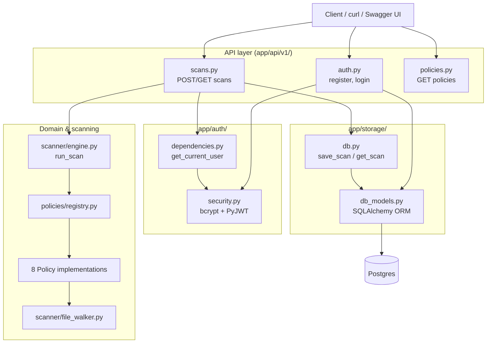
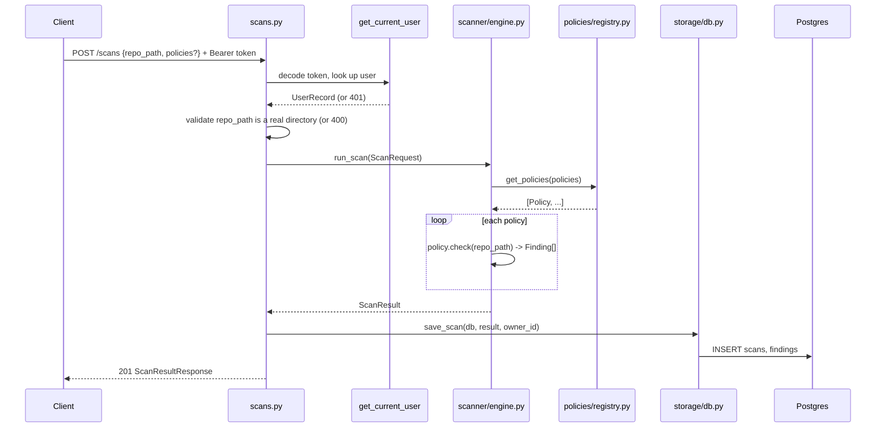

# Architecture & Design Decisions

This document explains *why* RepoGuard is built the way it is — the layering, the key tradeoffs, and the reasoning behind choices that aren't obvious just from reading the code. See [README.md](README.md) for what it does and how to run it.

## Component overview

**API layer** (`app/api/v1/`) only does HTTP concerns: request/response Pydantic models, status codes, dependency injection. It contains no scanning logic and no SQL.

**Auth** (`app/auth/`) is self-contained — password hashing and JWT handling don't know about FastAPI, and the `get_current_user` dependency is the only thing other layers import.

**Domain & scanning** (`app/domain/`, `app/scanner/`, `app/policies/`) is plain Python with zero framework dependencies — no FastAPI, no SQLAlchemy, no Pydantic. It operates on dataclasses (`Finding`, `ScanResult`, `ScanRequest`) and the filesystem.

**Storage** (`app/storage/`) translates between the domain dataclasses and SQLAlchemy ORM rows. It's the only layer that knows both vocabularies.

## Request flow: `POST /api/v1/scans`

Scanning is synchronous — the HTTP response already contains the finished scan. There's no background task queue. That's a deliberate scope boundary, not a missing feature: scans run against the local filesystem and the policies involved are all fast (file existence checks, regex over file contents, size checks), so there's nothing in the current workload that needs async execution. If a policy ever needed to do something slow (network calls, large archive extraction), this would be the first thing to revisit.

## Key design decisions

### Three representations of the same data, with explicit boundaries

`ScanResult`/`Finding` exist as three different things depending on which layer you're in:

| Layer | Representation | Why |
|---|---|---|
| Domain (`app/domain/models.py`) | Plain `@dataclass` | No framework dependency — the scanner and policies should never need to import FastAPI or SQLAlchemy just to represent a finding. |
| API (`app/api/v1/scans.py`) | Pydantic `BaseModel` | Pydantic is a validation/serialization library for the HTTP boundary specifically — request bodies need validation, responses need JSON schemas for `/docs`. |
| Storage (`app/storage/db_models.py`) | SQLAlchemy ORM | The persistence boundary needs its own representation (tables, foreign keys, cascade rules) that has nothing to do with HTTP. |

Conversion happens explicitly at each boundary (`ScanResultResponse.from_domain()`, the `_to_record`/`_to_domain`-shaped logic in `storage/db.py`) rather than letting one representation leak into another layer. The cost is some repetitive-looking field mapping; the benefit is that none of the three layers needs to change because one of the other two changed its framework.

### Policies are pluggable, not hardcoded

Every policy implements the same `Policy` interface (`policy_id`, `name`, `description`, `severity`, `check(repo_path) -> list[Finding]`) and self-registers in `policies/registry.py`. The scanner engine only ever calls `get_policies(...)` — it has no idea `no_secrets` or `dependency_pinning` exist. Adding a 9th policy never requires touching the scanner, the API, or any other policy. This is the Open/Closed principle in practice, not just in theory: every one of the 8 policies was added in its own PR without modifying `scanner/engine.py` once after it was first written.

### `os.walk(followlinks=False)`, not `Path.rglob`

`scanner/file_walker.py` originally used `Path.rglob("*")`. That has a real, easy-to-miss bug: a repo containing a symlink that points back up its own directory tree can make `sorted(root.rglob("*"))` hang, because `sorted()` eagerly consumes the entire (in this case infinite) generator before returning anything. `os.walk(root, followlinks=False)` is the documented, version-stable way to avoid ever recursing into a symlinked directory — verified with a test that creates a self-referential symlink and confirms the walk still completes instantly. The same rewrite also added directory pruning (skip `.git/` and anything matched by `.gitignore` *before* descending into it, not just filtering the results afterward), which avoids wasted work walking into things like `.venv/` or `node_modules/`.

### Content-scanning policies cap how much they read

`no_secrets` and `no_print_statements` scan file contents line-by-line, and originally called `read_text()` unconditionally — meaning a single multi-gigabyte file in a scanned repo would get read entirely into memory. Both now skip files over `MAX_READABLE_BYTES` (5MB), deferring to `large_files` to report on oversized files separately. `license_header` has a stronger version of the same fix: since it only ever needs the first few lines, it reads exactly `header_lines` lines via `itertools.islice` and never touches the rest of the file regardless of size.

### Postgres over SQLite, with normalized tables over a JSONB blob

The original MVP shipped with an in-memory dict (explicitly flagged as a placeholder from day one — see the original `Scan results are held in memory... there's no database yet` note in early commits). Postgres was chosen over SQLite specifically because it's closer to what a real backend role actually runs in production, even though SQLite would have been less setup. Within Postgres, `scans` and `findings` are two normalized tables with a foreign key and `cascade="all, delete-orphan"`, rather than one table with findings serialized into a JSONB column — this mirrors the `ScanResult`/`Finding` one-to-many relationship that already existed in the domain dataclasses, even though no current endpoint queries findings independently of their parent scan. The honest tradeoff: a single JSONB column would have been simpler and would have worked fine for the actual access pattern; normalized tables were chosen because they better demonstrate relational schema design.

### Auth: full JWT + user accounts, chosen over a simpler API key

This is the one place where the "right tool for the job" and "what's worth building for a portfolio" answers genuinely diverged, and it's worth being honest about that. RepoGuard is a single-operator local/Docker tool — a single shared API key checked against an environment variable would have been a better fit for the actual use case (no user table, no password hashing, no login flow to maintain). Full user accounts with JWT were chosen anyway, explicitly for the stronger interview story: it demonstrates registration, password hashing, token issuance/validation, and protecting routes, none of which a single API key would show. Within that choice:

- **`bcrypt` directly, not `passlib`.** `passlib`'s bcrypt backend detection reads a `bcrypt.__about__.__version__` attribute that current `bcrypt` (>=4.1) removed, which breaks or warns depending on version. Going straight to `bcrypt` sidesteps a real, documented compatibility problem and drops a dependency.
- **`PyJWT`, not `python-jose`.** `python-jose` is effectively unmaintained; `PyJWT` is actively maintained and the API surface needed here (`encode`/`decode`, HS256) is identical either way.
- **`OAuth2PasswordBearer` / `OAuth2PasswordRequestForm`**, FastAPI's standard pattern, rather than a custom header scheme — this gets a working "Authorize" button in `/docs` for free.
- **Access tokens only, no refresh tokens.** Token revocation/rotation is real added complexity (refresh token storage, rotation, revocation lists) that wasn't justified for a first auth pass. Tokens just expire (`ACCESS_TOKEN_EXPIRE_MINUTES`, default 30).

### Scan ownership: 404, not 403, for someone else's scan

Once auth existed, the next gap was that it only gated access without scoping anything — any authenticated user could fetch any `scan_id`. `ScanRecord.owner_id` (FK to `users.id`) closes that, but the more interesting decision is what `GET /scans/{id}` returns when a scan exists but belongs to someone else: it returns the *same* 404 as a scan_id that doesn't exist at all, rather than a 403. A 403 would confirm the scan_id is real, which is itself information a caller shouldn't get for free. Verified directly: registered two users, had one create a scan, and confirmed the other user's request and a request for a completely made-up scan_id are indistinguishable (both 404).

### Multi-stage Docker build

The first version of the `Dockerfile` did `pip install .` directly from a directory containing the source — which left a stray `build/lib/app/...` copy of the source sitting next to the real `app/` directory inside the image. The bug was visible immediately: running a scan against the container's own `/app` reported every finding twice, once for each copy. The fix is a standard two-stage build — build a wheel in a `builder` stage, then install *only the wheel* into a clean final stage — which leaves the runtime image with just the installed package, no leftover source or build artifacts.

### Testing against real systems, not mocks

Every test in this project runs against something real: policy tests use pytest's `tmp_path` to create actual files on disk (no filesystem mocking), and storage/API tests run against a real Postgres instance with real migrations applied. The one piece of real engineering required to make that practical is `tests/conftest.py`'s `db_session` fixture, which wraps each test in a SAVEPOINT (not a plain transaction) so that the application code under test can call `db.commit()` — as it does in production — without that commit leaking into the next test. A plain "begin a transaction, roll it back at teardown" approach would get prematurely finalized by that inner commit; the SAVEPOINT is restarted via an `after_transaction_end` event listener every time it ends. This was verified, not assumed: the full suite was run twice in a row against the same live database with row counts checked before and after, confirming zero residual rows.

## How this was built

Every feature above landed as its own branch and pull request — one policy, one infrastructure piece, or one hardening fix at a time, in roughly this order: domain models → policy interface + 3 hygiene policies → scanner engine → in-memory storage → the `/scans` API → the remaining 5 policies (`no_secrets`, `large_files`, `no_print_statements`, `license_header`, `dependency_pinning`) → `GET /policies` → CI → Docker → file-walker hardening → Postgres (as two PRs: infrastructure, then wiring it into the app) → JWT auth → per-user scan scoping. Each PR's tests were run against a real system (real filesystem, real Postgres, or a real running Docker container) before merging — not just "the unit tests pass," but actually curling a running container, registering real users, restarting a container to prove persistence, and so on.

## Known limitations

See the "Not yet implemented" section of [README.md](README.md) for the current, up-to-date list (it changes faster than this document should).
